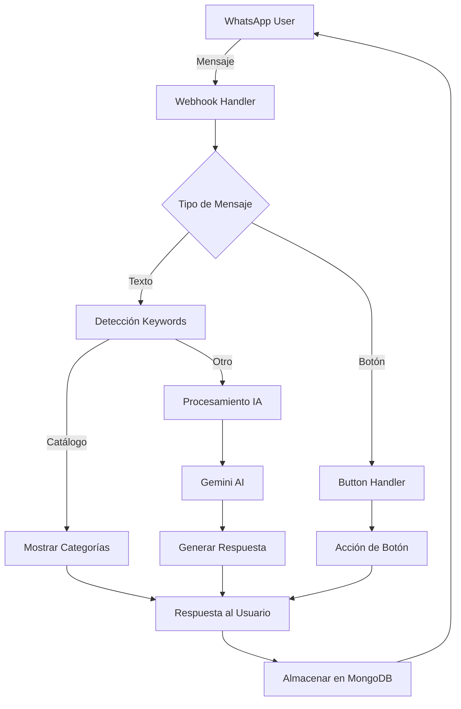

# 🏗️ Arquitectura y Flujo de Datos

## 📁 Estructura del Proyecto

```
whatsapp-joyeria/
├── 📁 api/                    # Endpoints de WhatsApp
├── 📁 assets/                 # Imágenes y recursos estáticos
├── 📁 core/                   # Lógica principal del bot
│   ├── bot.js                # IA conversacional + detección intenciones
│   ├── encryption.js         # RSA encryption para Flows
│   └── webhookHandler.js     # HMAC verification + ping responses
├── 📁 docs/                   # Documentación técnica
├── 📁 models/                 # Modelos de MongoDB
├── 📁 services/              # Servicios de negocio
│   ├── appointmentService.js # Sistema de citas con Flows
│   ├── notificationService.js# Notificaciones automáticas
│   └── whatsappService.js    # API WhatsApp wrapper
├── 📁 tests/                 # Archivos de prueba y validación
├── docker-compose.yml        # Configuración producción
└── index.js                 # Servidor principal con HMAC
```

## 💬 Cómo Opera el Bot

### 🔄 **Flujo de Conversación**

1. **Primer Contacto**
   - Mensaje de bienvenida automático con WhatsApp Flow
   - Aceptación de términos y condiciones
   - Presentación de opciones disponibles

2. **Navegación del Catálogo**
   - Usuario escribe: `"ver catálogo"`, `"productos"`, `"opciones"`
   - Bot muestra **categorías con botones interactivos**:
     - 💍 **Anillos** → Compromiso, Matrimonio, Moda
     - 🔶 **Cadenas** → Oro, Plata, Acero inoxidable  
     - 💎 **Aretes** → Perlas, Diamantes, Diseños únicos

3. **Selección de Productos**
   - Usuario hace clic en categoría → Muestra productos con imágenes
   - Clic en producto → Detalles completos + opciones de acción
   - **Acciones disponibles**: Ver más, Cotizar, Apartar, Agendar cita

4. **Conversación con IA**
   - Preguntas específicas procesadas por Gemini
   - Respuestas contextuales basadas en historial
   - Captura automática de información (nombre, preferencias, presupuesto)

5. **Gestión de Leads**
   - Scoring automático de calidad del prospecto (1-10)
   - Almacenamiento de toda interacción en MongoDB
   - Transferencia a agente humano cuando es necesario

### 🎯 **Palabras Clave para Activación Inmediata**

El bot detecta estas frases y muestra el catálogo **instantáneamente**:
- `"ver catálogo"` / `"catalogo"`
- `"ver productos"` / `"productos"`  
- `"mostrar joyas"` / `"opciones"`
- `"quiero ver"` / `"muéstrame"`

### 📊 **Sistema de Inteligencia**

- **Clasificación de Intenciones**: Saludo, Consulta, Cotización, Cita, Transferencia
- **Lead Scoring**: Evaluación automática 1-10 basada en engagement
- **Memoria Contextual**: Recuerda conversaciones previas y preferencias
- **Escalación Inteligente**: Detecta cuándo transferir a humano

## Flujo de Datos


